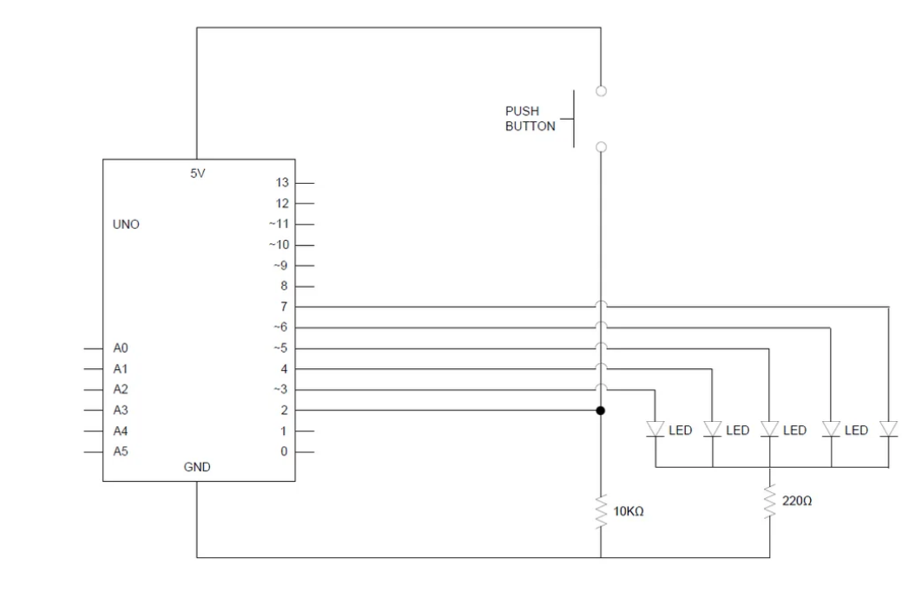
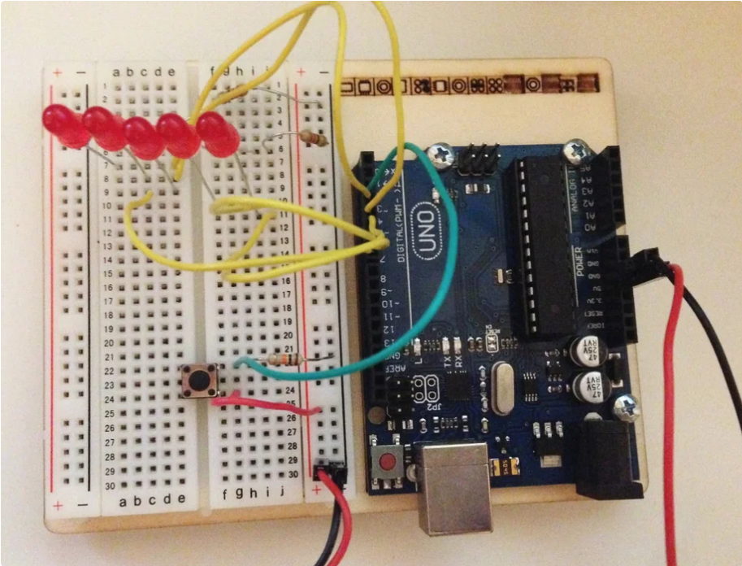

The following instructable will go through the steps to build a simple binary counter using the following materials.

1 x Arduino Uno

1 x Pushbutton

5 x LED's (however many bits you want your counter to be)

1 x 10k ohm Resistor

1 x 220 ohm Resistor (possibly 2 or 3 for a larger counter)

Attached is a schematic view of the circuit that we will be using. For demonstration, I have built a 5-bit counter. You should assemble this circuit on a protoboard and attach to your Arduino.

